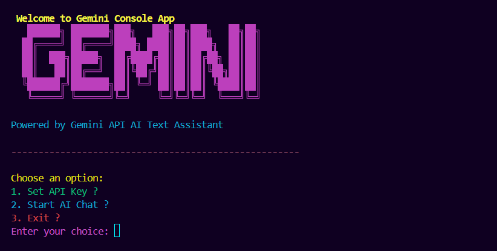

# 🌌 Gemini Console App

A simple **Java console-based AI chat application** powered by **Google Gemini API**.
This project demonstrates how to integrate AI text generation into a pure Java CLI (no frameworks, no Maven).

---

## 🚀 Features

* 🎨 **Colorful console UI** (ANSI colors for better readability)
* 🔑 **Secure API key management** (via `.env` file)
* 💬 **Interactive AI chat** with user prompts
* 🧠 **Lightweight JSON handling** (no external libraries)
* 🪶 **Works without Maven or Gradle**
* ⚙️ **Cross-platform** — works on Windows, Linux, macOS

---

## 📂 Project Structure

```
GeminiConsoleApp/
│
├── ConsoleBanner.java        # Fancy console banner for startup
├── GeminiConsoleMenu.java    # Main interactive menu logic
├── GeminiAPI.java            # Handles Gemini API request/response
├── DotenvLoader.java         # Reads API key from .env file (optional)
├── .env                      # Your private API key (not pushed to GitHub)
├── .gitignore                # Ensures .env and class files are ignored
└── README.md                 # Project documentation
```

---

## ⚙️ Setup Instructions

### 1️⃣ Clone the Repository

```bash
git clone https://github.com/your-username/GeminiConsoleApp.git
cd GeminiConsoleApp
```

### 2️⃣ Create `.env` File

Inside the project folder, create a `.env` file:

```bash
GEMINI_API_KEY=your_api_key_here
```

> ⚠️ **Never share this key** or push your `.env` file to GitHub.
> It’s already ignored via `.gitignore`.

### 3️⃣ Compile the Source Files

```bash
javac -encoding UTF-8 DotenvLoader.java ConsoleBanner.java GeminiConsoleMenu.java
```

---

## ▶️ How to Run This Program

Once compiled successfully, run the application using:

```bash
java GeminiConsoleMenu
```

You’ll see the main menu appear like this:

```
🌟 Welcome to Gemini Console 🌟
Choose an option:
1. Set API Key 🔑
2. Start AI Chat 🤖
3. Exit ❌
```

### 🪄 Example Interaction

```
You: Tell me a fun fact about space
Gemini ✨: Jupiter’s Great Red Spot is a storm that has raged for at least 400 years!
```

> 💡 Tip: If your `.env` file is configured correctly, the app will automatically detect your API key.

---

## 🎨 Color Codes

| Meaning           | Color     |
| ----------------- | --------- |
| Correct / Success | 🟢 Green  |
| Warning / Error   | 🔴 Red    |
| Info / Prompt     | 🟣 Purple |
| Menu              | 🟡 Yellow |

---

## 🧩 Tech Stack

| Component   | Technology                      |
| ----------- | ------------------------------- |
| Language    | Java 11+                        |
| API         | Google Gemini (via REST)        |
| HTTP Client | Built-in `java.net.http`        |
| Config      | `.env` (manual or DotenvLoader) |

---

## 🧠 Common Issues

| Problem                                                         | Cause                      | Fix                                                  |
| --------------------------------------------------------------- | -------------------------- | ---------------------------------------------------- |
| `Set GEMINI_API_KEY env var or export your key before running.` | API key not found          | Add `.env` file or set environment variable          |
| `HTTP 400 / 403`                                                | Invalid or expired API key | Generate a new one from Google AI Studio             |
| Unreadable response                                             | You’re printing full JSON  | Use `GeminiAPI.extractText()` to parse the text only |
| Garbled symbols (ΓÜá)                                           | Wrong encoding on Windows  | Compile using `javac -encoding UTF-8`                |

---

## 🧾 License

This project is open-source under the [MIT License](LICENSE).

---

## 👨‍💻 Author

**Dravid P.A**
💡 Building creative console & AI integrations in Java.

---

### ⭐ If you found this useful, don’t forget to give it a star on GitHub!

---
